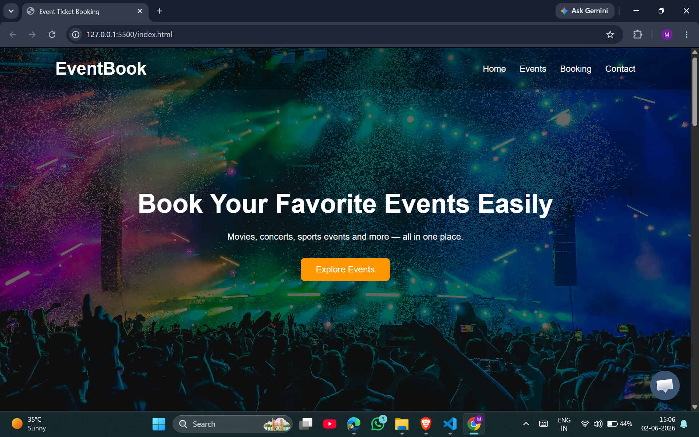
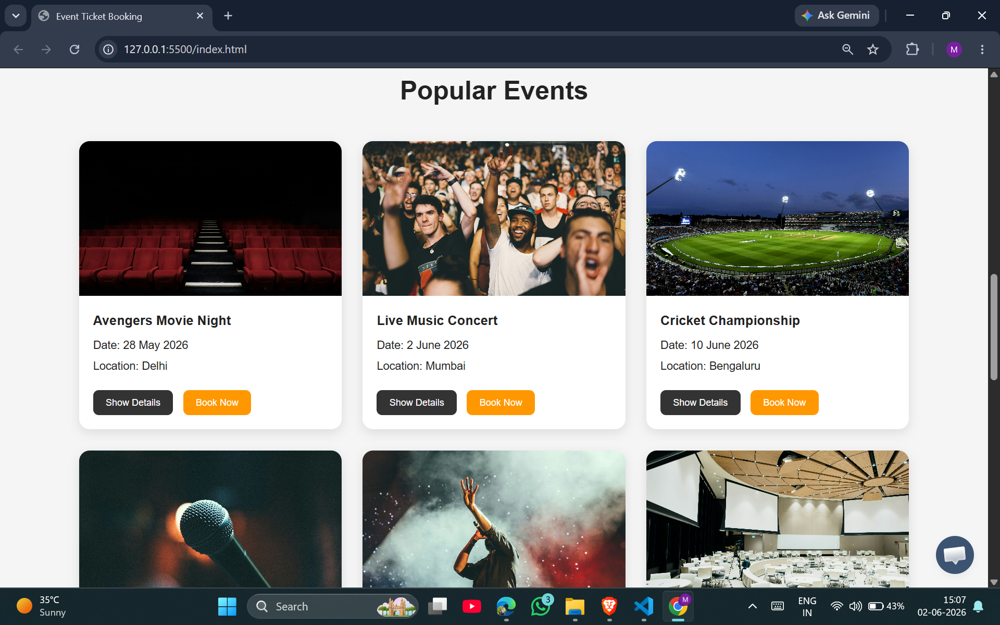
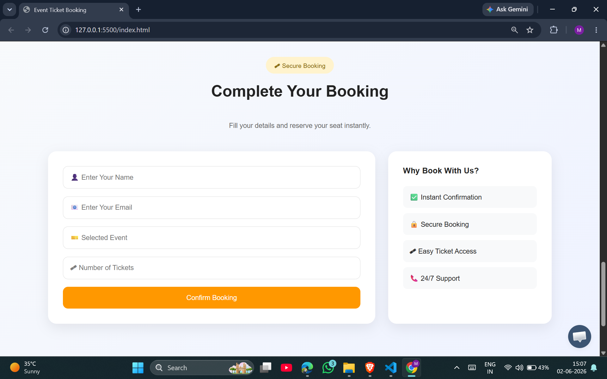

# 🎟️ Event Ticket Booking System

A responsive Event Ticket Booking web application built using HTML, CSS, and JavaScript.

Users can browse different events, view event details, select an event, and book tickets through a simple and interactive booking form.

---

## 🚀 Features

- Responsive Navigation Bar
- Mobile Menu Toggle
- Hero Section with Call-to-Action
- Event Listing Cards
- Show/Hide Event Details
- One-Click Event Selection
- Smooth Scrolling to Booking Form
- Booking Form Validation
- Email Validation
- Booking Confirmation Popup
- Modern and Responsive UI Design

---

## 📸 Project Preview

### Home Page


### Events Section


### Booking Form


---

## 🛠️ Technologies Used

- HTML5
- CSS3
- JavaScript
---

## 🎯 Functionality

### Event Browsing
Users can view multiple events including:
- Movie Shows
- Music Concerts
- Sports Events
- Comedy Shows
- DJ Festivals
- Tech Summits

### Event Details Toggle
Each event card contains a "Show Details" button that expands and collapses additional information.

### Book Now Feature
Clicking the "Book Now" button:
- Automatically selects the event
- Fills the booking form
- Smoothly scrolls to the booking section

### Form Validation
The application validates:
- Name field
- Email field
- Selected Event
- Number of Tickets

Users receive a confirmation alert after successful booking.

---

## 📱 Responsive Design

The website is fully responsive and works on:
- Desktop
- Laptop
- Tablet
- Mobile Devices

---

## ⚙️ How to Run

1. Clone the repository

```bash
git clone https://github.com/your-username/event-ticket-booking.git
```
2. Open the project folder
3. Run index.html in your browser
